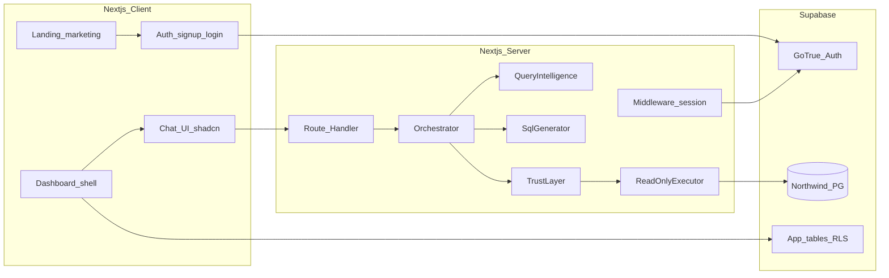

# DataTalk: Query Intelligence + Reliability & Trust

Project plan for the Northwind NL analytics assignment (Next.js, TypeScript, Supabase, shadcn/ui). See repository `README.md` for setup.

## Implementation checklist

- [ ] Scaffold + design tokens (white / gray / green), shadcn
- [ ] Landing + dashboard shell + Supabase Auth (email/password, verify link)
- [ ] App tables + RLS (`conversations`, `messages`)
- [ ] Schema allowlist + SQL validator + read-only executor
- [ ] `/api/chat` orchestration + trust report
- [ ] Chat UI + thread persistence + “Why this answer?”
- [ ] Query intelligence (clarifications, references)
- [ ] Wild card: metric dictionary **or** eval harness **or** follow-ups
- [ ] README polish + demo video

---

## Goals (what reviewers will see)

- A **polished first impression**: minimal **landing** (white / soft gray / restrained green accents) and an **authenticated dashboard** shell (same palette) leading into the product.
- A **business-facing chat** (shadcn) that turns vague questions into **clarifications or structured plans**, then **safe read-only SQL**, then **narrated results** (numbers + short explanation).
- **Honest failure**: when the system should not answer, it says why (ambiguous metric, unsafe request, no matching schema).
- **Show your work** in-product: collapsible “Why this answer?” (plan, SQL, validation steps, confidence rationale) — this supports both tracks and the README/video.

Depth over breadth: implement **one orchestration path** end-to-end extremely well rather than many half-finished modes.

---

## Suggested Wild Card (pick one for ~20h scope)

1. **Living “metric dictionary” (recommended)** — Small curated YAML/DB table of business metrics. The UI exposes it; the model must **cite metric IDs** in its plan.
2. **Embedded eval harness (“trust lab”)** — Golden questions; pass/fail for SQL validity, allowlist, row cap, answer shape.
3. **Proactive “next questions”** — 2–3 grounded follow-ups after each answer.

**Recommendation:** (1) or (2).

---

## Architecture (modular boundaries)

**Folder/module sketch**

- `lib/northwind/schema.ts` — allowlisted tables/columns, FK hints.
- `lib/ai/client.ts` — model calls (OpenRouter / OpenAI-compatible).
- `lib/datatalk/types.ts` — Zod schemas for pipeline artifacts.
- `lib/datatalk/query-intelligence.ts` — multi-turn state.
- `lib/datatalk/sql-validator.ts` — deterministic checks before execution.
- `lib/datatalk/executor.ts` — read-only execution, timeouts, limits.
- `app/api/chat/route.ts` — orchestration entry.
- `middleware.ts` — Supabase session refresh; protect `/dashboard`.
- `app/(marketing)/page.tsx` — landing.
- `app/(auth)/login`, `signup`, `auth/callback` — auth flows.

---

## Landing, dashboard, and Supabase Auth

**Visual direction:** White backgrounds, neutral gray typography/borders, one primary green (Tailwind/CSS variables). shadcn: Card, Button, Input, Label.

**Landing (`/`):** Headline + subcopy; **Get started** → signup; **Log in**.

**Dashboard (`/dashboard`):** Shell with nav, user menu (sign out), main area for chat/results/trust.

**Auth:** Email/password signup with confirm password (Zod). Supabase **Confirm email** enabled. `emailRedirectTo` → `/auth/callback`. **Site URL** + redirect allowlist for localhost and production.

**Integration:** `@supabase/supabase-js` + `@supabase/ssr`, cookie sessions, middleware. Never expose service role to the browser.

**RLS:** `conversations` / `messages` with `user_id = auth.uid()`. NL→SQL execution server-side only with read-only DB credentials.

---

## Track A: Query Intelligence

- Thread state: entities, date ranges, last metric/grain.
- Stages: Understand → Resolve references → Plan (or one clarification question).

---

## Track B: Reliability & Trust

- Read-only DB role; allowlist; AST/parser guard (single `SELECT`, no `;`, no DML).
- Limits: max rows, statement timeout, capped `LIMIT`.
- Confidence: low/med/high + bullet reasons.

---

## Stack

- Next.js App Router, TypeScript strict, Tailwind, shadcn/ui.
- Supabase Auth + Postgres (Northwind + app tables).
- AI: env-driven OpenRouter or OpenAI-compatible base URL (e.g. Ollama locally).

---

## AI models (summary)

- Free/small models OK if validation + repair loop is strong.
- Cheap paid on OpenRouter: e.g. `openai/gpt-4o-mini` for smoother JSON/SQL.
- Local: Ollama OpenAI-compatible API + ~8B Q4 on 8GB VRAM — pipeline smoke tests.

---

## Deliverables (assignment)

| Required | Approach |
|----------|----------|
| Demo video | Landing → auth → dashboard → NL flows + trust + failure |
| README | Approach, NL2SQL threat model, trade-offs, improvements |
| Working code | Env template, Supabase SQL migrations for RLS tables |

---

## Edge cases (document even if not fully solved)

- Ambiguous customer names; date windows; NULL dimensions; join fan-out.

---

## Implementation order

1. Scaffold + design tokens; landing + dashboard layout.
2. Supabase Auth + middleware + callback + protect `/dashboard`.
3. App tables + RLS.
4. Schema allowlist + executor + validator.
5. Orchestration API + auth gate.
6. Chat UI + persistence + trust panel.
7. Query intelligence polish.
8. Wild card.
9. README + video.

---

## Out of scope (for this prototype)

- Fine-tuning custom models.
- Heavy multi-agent frameworks — prefer explicit staged pipeline.
